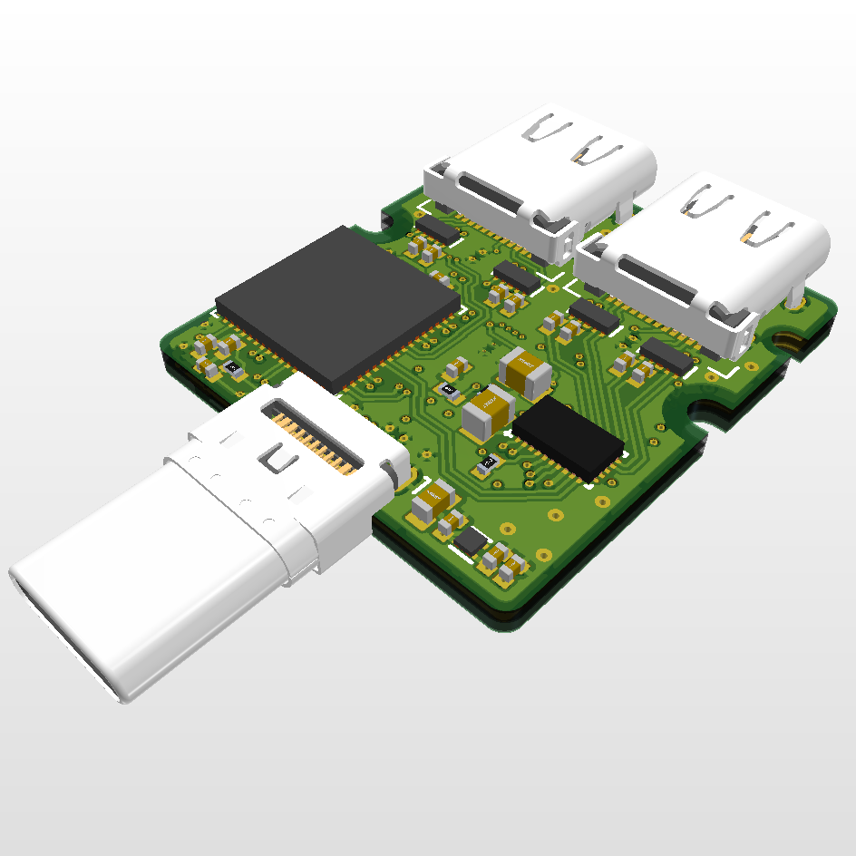
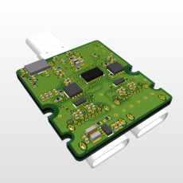

# Framework 2 USB-C Expansion Card

A 2 USB-C expansion card for Framework laptops. Currently in design using the `TUSB8044A`. Supports USB 3.2

## View the [current schematic](https://altrup.github.io/Framework-2-USB-C-Expansion-Card/Framework%202%20USB-C%20Expansion%20Card.pdf)

|  |  |
| ----- | ----- |
